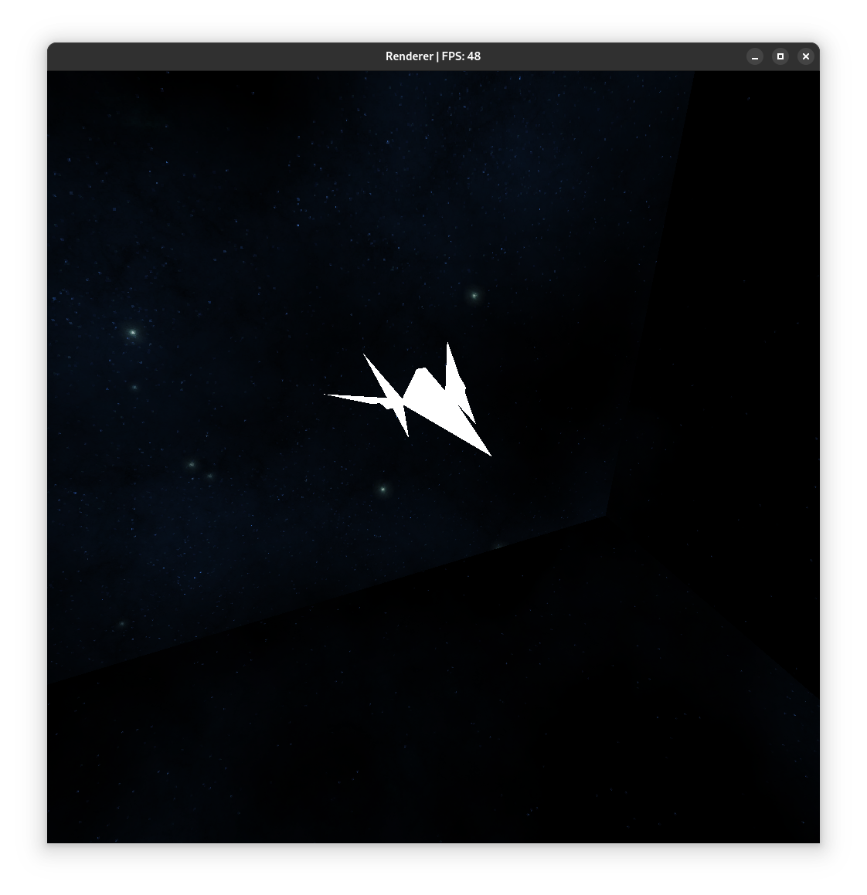
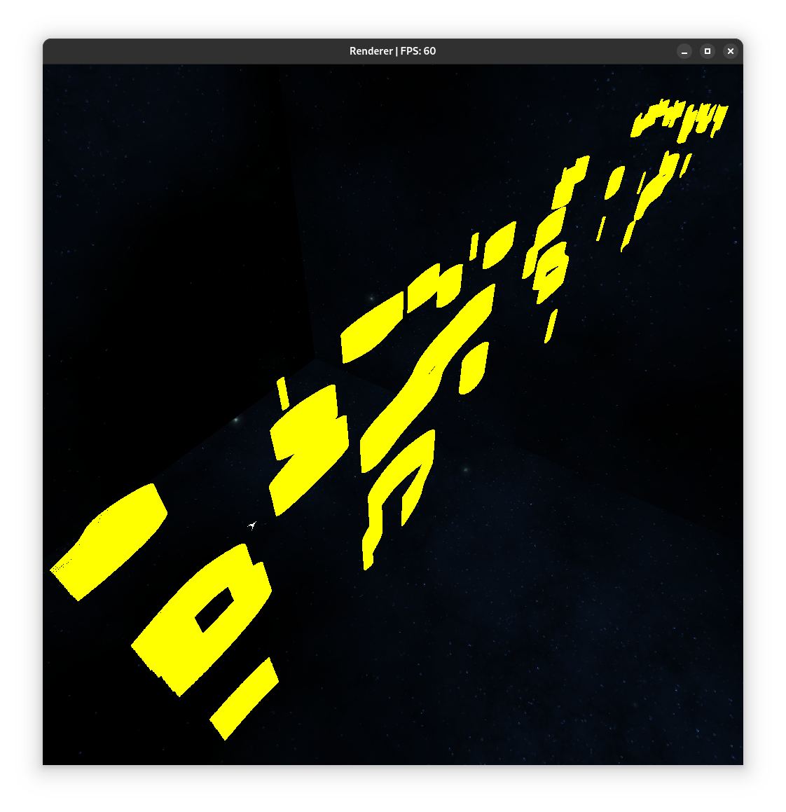
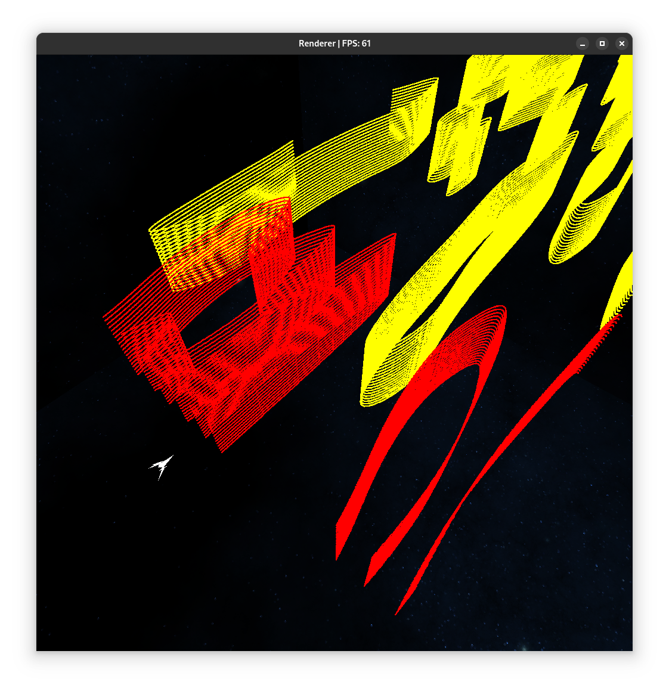

### Fakultet elektrotehnike i računarstva, Sveučilište u Zagrebu
### Akademska godina: 2024./2025.
### Autor: Davor Najev

<figure>
  
  <figcaption>Pogled na letjelicu u pokretu</figcaption>
</figure>

## Opis projekta
Cosmic Ravine Evader je igra u kojoj kontroliramo svemirsku letjelicu koja prolazi kroz svemirske klance,
cilj je doći što dalje bez sudara sa zidovima klanaca.

Pri ulazu u igru, možemo vidjeti letjelicu kako prolazi pokraj pogleda kamere, a nakon što
prođe pored nje, ona se zaključa na latjelicu i počne ju pratiti, efektivno dajući igraču
pogleda iz trećeg lica na nju.

<figure>
  
  <figcaption>Pogled na letjelicu u početnom trenutku</figcaption>
</figure>

Igrač nad letjelicom ima bočnu i okomitu kontrolu dok se ona automatski kreće prema naprijed.
Letjelica cijelo vrijeme konstantno ubrzava.
Moguće je privremeno malo usporiti ili ubrzati letjelicu radi lakšeg manevriranja.
Kamera i letjelica dinamično reagiraju na brzinu letjelice.
Letjelica se okreće u smjeru vektora brzine s određenom interpolacijom pokreta,
a kamera se udaljava i približava letjelici ovisno o brzini, također interpolirano.

Klanci se generiraju u beskonačnost dokle se igrač ne zabije u zid.
Tijekom vremena oni postaju uži radi povećanja težine/izazova.

Kada se igrač sudari sa zidom klanca, pokrene se animacija pada letjelice te se ispisuju
bodovi/score.
Moguće je ponovno pokrenuti igru pritiskom na gumb.

## Kontrole
Moguće je upravljati letjelicom pomoću tipkovnice ili standardnog upravljača.
U nastavku su kontrole upravljača označene za Xbox One Controller, međutim
igra će raditi za slične upravljače pritiskom ekvivalentnih gumbova.

| Naredba                                 | Tipkovnica     | Upravljač   |
|-----------------------------------------|----------------|-------------|
| Lijevo                                  | ArrowLeft      | LeftAnalogX |
| Desno                                   | ArrowRight     | LeftAnalogX |
| Gore                                    | ArrowUp        | LeftAnalogY |
| Dolje                                   | ArrowDown      | LeftAnalogY |
| Ubrzaj                                  | Left Shift     | RT          |
| Uspori                                  | Control        | LT          |
| Vrati se na početak                     | R              | Y           |
| Zaustavi igru                           | P              | Pause       |
| Otvori sučelje s dodatnim postavkama    | Right Shift    | B           |
| Izađi                                   | ESC            | Start       |

## Detalji implementacije
Klanci se generiraju proceduralno pomoću Perlinovog šuma u particijama jednake veličine.

<figure>
  
  <figcaption>Pogled na teren odozgora</figcaption>
</figure>

Postoji bazen od 10 particija koje su u jednom trenutku prikazane. 
Kada letjelica prođe rub između particija, particija se stavlja na mjesto sljedećeg segmenta u nizu i regenerira svoje podatke.
Ovo je napravljeno iz više razloga.
Prvo kako bi računanje kolizije između letjelice i terena bilo učinkovitije, a drugi je razlog olakšano generiranje novih segmenata.
Generiranje se provodi višedretveno pomoću bazena dretvi (engl. Thread Pool) čime se osigurava
da se teren generira na vrijeme te da nema zastajkivanja.
Provodi se uklanjanje (engl. culling) nepotpunih zidova na prijelazima gustoće klanaca.

<figure>
  
  <figcaption>Prikaz uklonjenih dijelova terena</figcaption>
</figure>

Za detekciju kolizije se igrač aproksimira s kockom paralelnom s koordinatnim osima radi jednostavnosti
izračuna sa zidovima klanca.
Prati se u kojem se segmentu trenutno nalazi igrač pa se detekcija provodi samo nad njime jer
nema potrebe provjeravati koliziju nad segmentima u kojima se letjelica ne nalazi.

Ukupni bodovi se računaju kao ukupna prijeđena udaljenost od početnog položaja.

Sve animacije i interpolacije su implementirane u ovisnosti s `deltaTime` varijablom što znači
da će one biti neovisne o brzini.

Prikazana je kupola scene s temom svemira pomoću GL_CUBEMAP.

Programska rješenja su ostvarena u programskom jeziku C++ i grafičkom API-ju OpenGL.

## Pokretanje
Za pokretanje demonstracije potrebno je izvršiti naredbu:  
`./run.sh game`
